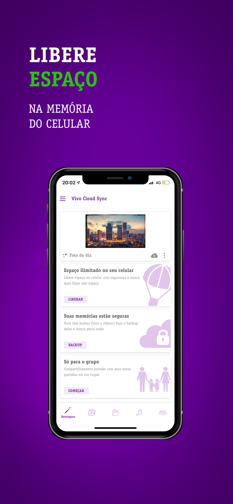

# Fs-cloud

Fs Cloud is a cloud syncing hybrid app built in reactJS and react-native.
 
It is a cloud storage where the user can store its data ( photos, videos, music files, documents ). Users can upload files from the Web and can access them over their mobile as well. Files can be uploaded from their mobile as well. 
 
Users can share these files with their friends over mail or social websites. They can create a group and share it with friends and all users can add files in it which are visible to all other users in that group.
 
The website is developed in 2 different languages (English and Portuguese )
 

### ScreenShot:-

Figure : 1 web login

 

Figure : 2 Homepage

 

Figure : 3 gallery screen

 
